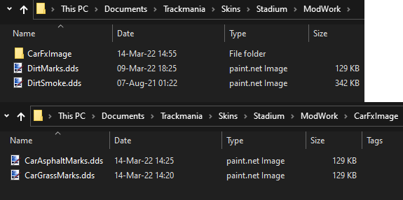

# TrackMania 2020 Custom Skid Marks

## How to install
**WARNING: This will overwrite custom mods on some maps.**

To change your skids follow these steps:
1. [Download](https://github.com/snixtho/tm2020-skids/releases/latest/download/Skids.zip) the ZIP file and extract the `Skids` folder.
2. Then inside `Documents\Trackmania\Skins\Stadium` create a folder called `ModWork`.
3. Follow the instructions below for each surface.

### Asphalt/Tarmac Skids
1. Create a folder called `CarFxImage` inside `Documents\Trackmania\Skins\Stadium\ModWork`.
2. Inside the downloaded and extracted `Skids` folder, open the `Asphalt` folder.
3. Chose your skid mark represented as a .dds file, and copy it to `Documents\Trackmania\Skins\Stadium\ModWork\CarFxImage`.
4. Rename the copied file inside `Documents\Trackmania\Skins\Stadium\ModWork\CarFxImage` to `CarAsphaltMarks.dds`. So that the file looks as following: `Documents\Trackmania\Skins\Stadium\ModWork\CarFxImage\CarAsphaltMarks.dds`.

### Dirt Skids
1. Inside the downloaded and extracted `Skids` folder, open the `Dirt` folder.
2. Chose your skid mark represented as a .dds file, and copy it to `Documents\Trackmania\Skins\Stadium\ModWork`.
3. Rename the copied file inside `Documents\Trackmania\Skins\Stadium\ModWork` to `DirtMarks.dds`. So that the file looks as following: `Documents\Trackmania\Skins\Stadium\ModWork\DirtMarks.dds`.
4. As a bonus, you can disable the smoke effect by copying the `DirtSmoke.dds` to `Documents\Trackmania\Skins\Stadium\ModWork`

### Grass Skids
1. Create a folder called `CarFxImage` inside `Documents\Trackmania\Skins\Stadium\ModWork`.
2. Inside the downloaded and extracted `Skids` folder, open the `Grass` folder.
3. Chose your skid mark represented as a .dds file, and copy it to `Documents\Trackmania\Skins\Stadium\ModWork\CarFxImage`.
4. Rename the copied file inside `Documents\Trackmania\Skins\Stadium\ModWork\CarFxImage` to `CarGrassMarks.dds`. So that the file looks as following: `Documents\Trackmania\Skins\Stadium\ModWork\CarFxImage\CarGrassMarks.dds`.

Here is an example of how it looks with all surfaces installed and no dirt smoke:

You can repeat the process for changing skids, just replace the files for the new skids. You do not need to restart the game or reload the map, changing skids will update live ingame. However, if you remove the skids, you will need to restart your game first.

### Removing the custom skids
To remove the custom skid marks, either rename or remove the folder called `ModWork` in `Documents\Trackmania\Skins\Stadium`. You will need to restart the game, otherwise skid marks will appear solid black.
